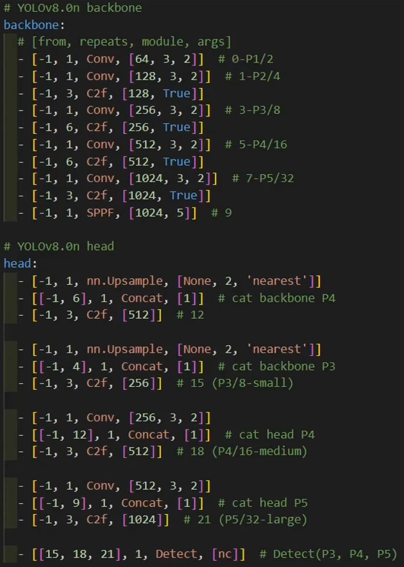
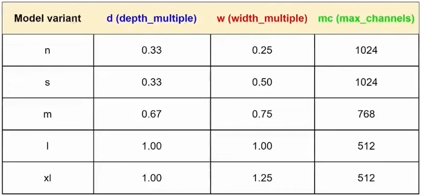

 
 

 

# Main Blocks
## Backbone

**Function**: The backbone, the feature extractor, responsible for extracting meaningful features ***from the input***.

**Activities**:
- Captures simple patterns in the initial layers, such as edges and textures.
- Can have multiple scales of representation as you go, capturing features from different levels of abstraction.
- Will provide a rich, hierarchical representation of the input.

**Components**:
- *P1 to P5*: represent different stages or layers in the Backbone.
  - *Conv layers*: convolutions and downsampling operations to reduce the spatial dimensions of the input. 
  
  - *C2f blocks*: combination of convolutions and shortcut connections. 
  
    - *Bottleneck*: sequence of convolutional blocks with a shortcut option. 
    
- *SPPF (Spatial Pyramid Pooling Fast)*: located at the end of the Backbone, aggregates information from different scales, ensuring the model captures features from various receptive fields (sizes of objects). 

## Neck
 

**Function**: The neck acts as a ***bridge between the backbone and the head***. Basically the Neck assembles feature pyramids by aggregating feature maps obtained by the Backbone.

**Activities**:
- Perform concatenation or fusion of features of different scales to ensure that the network can detect objects of different sizes.
- Integrates contextual information to improve detection accuracy by considering the broader context of the scene.
- Reduces the spatial resolution and dimensionality of resources to facilitate computation, a fact that increases speed but can also reduce the quality of the model.

**Components**:
- *Concat*: merges feature maps from different layers, allowing the model to combine features at various scales (e.g., P3, P4, P5).
- *Upsample*: increases the resolution of feature maps, enabling the model to retain more spatial detail, which is crucial for detecting smaller objects.
- *Additional C2f and Conv layers*: used to process the feature maps and prepare them, same as in the Backbone.

## Head
 
 

**Function**: The Head is responsible for making the final predictions, which include the bounding box coordinates (localization), object class (classification), and confidence scores.

**Activities**: 
- Generates bounding boxes associated with possible objects in the image.
- Assigns confidence scores to each bounding box to indicate how likely an object is present.
- Sorts the objects in the bounding boxes according to their categories.

**Components**:
- *Detect Layers (P3, P4, P5)*: correspond to different resolutions of the feature maps and handle the final predictions for objects of varying sizes.
- *Convolutional Layers*: produce the final bounding boxes and class scores.
- *Cls (Class)*: predicts the class of the detected object.
- *Bbox (Bounding Box)*: predicts the location and size of the object.

 

# Fundametal Components
## Kernel (k)
A small set of numbers (or filter) that slides over the input during convolution. Its job is to detect specific features in the input by applying small, local operations. Each number in the kernel is a weight that multiplies the matching part of the input during the process. 
  
Kernel moves across the input (image) and perform a dot operation with the input, producing a feature map. 

## Stride (s)
The stride is the number of pixels the kernel moves in each step. A stride of 1 means the kernel moves one pixel at a time, while a stride of 2 means the kernel moves two pixels at a time. Larger strides result in a smaller output size, reducing the amount of detail (low quality) but speeding up the process. Smaller strides keep more detail but take longer to compute.   
Example of a stride of 1: 

## Padding (p)
Padding is the process of adding extra pixels (typically zeros) around the input to ensure the kernel can move across the entire input. Padding is used to maintain the spatial dimensions of the input and output, ensuring that the output has the same size as the input. Padding is essential to prevent the loss of information at the edges of the input. 

- Zeros Padding: adds zeros around the input.

- Replication Padding: replicates the edge pixels of the input.

## Variables Variant

# References: 
- https://medium.com/@juanpedro.bc22/detailed-explanation-of-yolov8-architecture-part-1-6da9296b954e
- https://youtu.be/HQXhDO7COj8?si=1zRhCbkiAkM65nTm
- https://github.com/dtdo90/yolov8_detection/tree/main